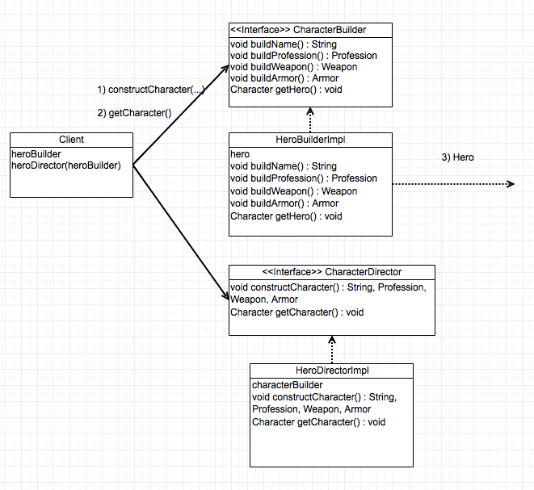

# builder_design_pattern

#Intent
The intent of the builder pattern is to separate the construction of a complex object from its representation so that the same construction process can create different representations.

#Motivation

The telescoping constructor anti-pattern occurs when the increase of object constructor parameter combination leads to an exponential list of constructors. Instead of using numerous constructors, the builder pattern uses another object, a builder, that receives each initialization parameter step by step and then returns the resulting constructed object at once.

#Applicability

Use the Builder pattern when:

1) The algorith for creating a complex object should be independent of the parts that make up the object and how they're assembled.

2) The construction process must allow different preresentations for the object that's constructed.

#Problem solved in example

In this example, we try to solve the problem of separating the construction of the complex object through the use of the Director and Builder classes.  In this example, we have a HeroDirectorImpl class which is resposible for construction an object using the CharacterBuilder interface.  The HeroBuilder class, which is an implementation of CharacterBuilder, receives the input from the CharacterDirector and builds the hero.  The Client class then asks for the hero and it is returned.